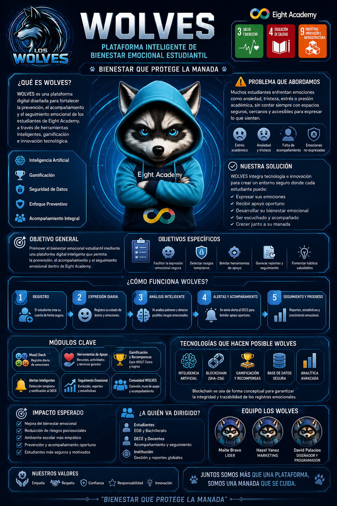

# WOLVES

  

  <strong>Plataforma digital de bienestar emocional estudiantil para Eight Academy.</strong> 
  La tecnología detecta. La comunidad acompaña.

---

## Integrantes

| Integrante | Rol | Foto |
|---|---|---|
| Maite Bravo | Líder del Proyecto |  |
| Hazel Yánez | Marketing | Foto pendiente de subir como `assets/HAZEL.png` |
| David Palacios | Diseñador y Programador |  |
| Anita Parreño | Mentora | Mentora del proyecto |

---

## Problema Que Se Quiere Resolver

Muchos estudiantes enfrentan estrés académico, ansiedad, frustración, tristeza y dificultades para expresar sus emociones dentro del entorno escolar. En ocasiones estas señales pasan desapercibidas, afectando la convivencia, el rendimiento académico y el bienestar emocional.

Las instituciones educativas no siempre cuentan con herramientas tecnológicas preventivas, visuales y atractivas para acompañar el estado emocional de los estudiantes en tiempo real.

## Solución Propuesta

**WOLVES** es una plataforma gamificada de bienestar emocional estudiantil que integra Mood Check, Wolf AI, retos de bienestar, EightCoins, tienda, blockchain conceptual, panel DECE y administración institucional.

El objetivo es ayudar a los estudiantes a reconocer sus emociones, fortalecer hábitos saludables y activar acompañamiento oportuno cuando sea necesario.

## Cómo Funciona

| Paso | Proceso |
|---|---|
| 1 | El estudiante realiza su **Mood Check** diario. |
| 2 | **Wolf AI** entrega orientación empática y herramientas de apoyo. |
| 3 | Si se detectan señales de riesgo, se generan alertas para el DECE. |
| 4 | El DECE revisa alertas, agenda citas y registra seguimiento. |
| 5 | Los estudiantes completan retos y ganan **EightCoins**. |
| 6 | La institución visualiza estadísticas para tomar mejores decisiones. |

## ODS Vinculados

| ODS | Nombre | Aplicación En WOLVES |
|---|---|---|
| ODS 3 | Salud y Bienestar | Promueve bienestar emocional y prevención temprana. |
| ODS 4 | Educación de Calidad | Integra destrezas socioemocionales en el entorno educativo. |
| ODS 9 | Innovación | Usa tecnología, gamificación y analítica institucional. |

## Tecnologías

| Categoría | Tecnología |
|---|---|
| Frontend | HTML5, CSS3, JavaScript puro |
| Datos Demo | localStorage |
| Base de datos preparada | Firebase Firestore |
| Autenticación preparada | Firebase Authentication |
| Gamificación | EightCoins, retos, ranking, insignias y tienda |
| Hosting | GitHub Pages |
| Control de versiones | GitHub |

## Funcionalidades Principales

| Módulo | Descripción |
|---|---|
| Portal Público | Landing institucional con problema, solución, ODS, planes y contacto. |
| Acceso Institucional | Login y registro por roles. |
| Panel Estudiante | Perfil RPG, Mood Check, Wolf AI, retos, wallet, tienda y comunidad. |
| Panel DECE | Alertas, semáforo emocional, citas, fichas y estadísticas. |
| Panel Administrador | Usuarios, inventario, productos, NFTs, auditoría y configuración. |
| Wallet | EightCoins, equivalencia USD simulada y solicitudes de recarga al administrador. |
| Blockchain Explorer | Registro conceptual de retos, logros, recompensas y canjes no sensibles. |

## Arquitectura De La Plataforma

[Ver diseño de WOLVES en Figma](https://www.figma.com/make/y3BM2oadM6X2m0E1mzyGiu/Crear-mapa-de-flujo?code-node-id=0-9&p=f&t=ZRqs2MdGvjIjTj3A-0&fullscreen=1)

  

## Impacto Esperado

- Detectar tempranamente situaciones de riesgo emocional.
- Mejorar la convivencia escolar.
- Fortalecer la salud mental estudiantil.
- Incentivar la participación mediante gamificación.
- Generar datos institucionales útiles sin exponer información sensible.

---

## Entregable 3

### MVP Web

[Abrir Plataforma WOLVES](https://alparrenob-ship-it.github.io/LOS-WOLVES/)

### Video Demo

Pendiente de agregar enlace.

### Pitch Deck

Pendiente de agregar enlace.

### Whitepaper

[Ver Whitepaper WOLVES](wolves-mvp/docs/whitepaper.md)

### Infografía

  

