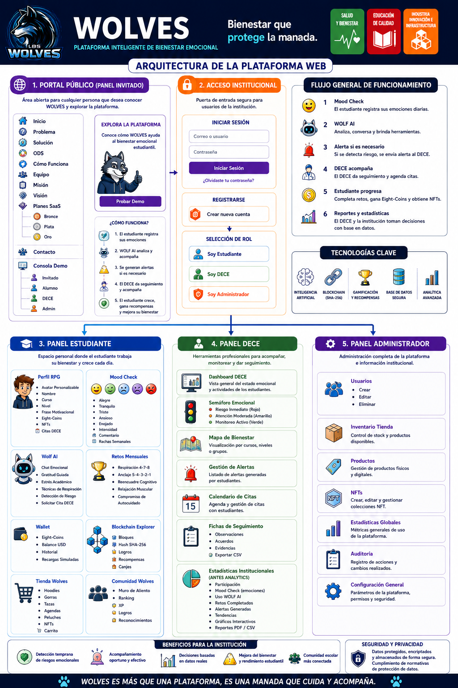

# Wolves

Plataforma digital de bienestar emocional estudiantil diseñada para fortalecer la prevención, el acompañamiento y el seguimiento emocional dentro de Eight Academy.

# Integrantes

| Integrante | Rol | Foto |
|------------|-----|------|
| Maite Bravo | Líder del Proyecto |  |
| Hazel Yánez | Marketing |  |
| David Palacios | Diseñador y Programador |  |
| Anita Parreño | Mentora | |

# Problema que se quiere resolver

Actualmente muchos estudiantes enfrentan estrés académico, ansiedad, frustración, tristeza y dificultades para expresar sus emociones dentro del entorno escolar. En muchas ocasiones, estas emociones pasan desapercibidas, provocando problemas de convivencia, bajo rendimiento académico, desmotivación y afectaciones en la salud emocional de los estudiantes.

Además, las instituciones educativas no siempre cuentan con herramientas tecnológicas innovadoras que permitan dar seguimiento emocional de manera dinámica, preventiva y atractiva para los estudiantes. Esto genera poca participación en actividades de bienestar y limita el acompañamiento emocional oportuno.

# Solución propuesta

WOLVES es una plataforma digital de bienestar emocional estudiantil que utiliza Inteligencia Artificial y gamificación para ayudar a los estudiantes a identificar, expresar y regular sus emociones. Los usuarios pueden realizar un “Mood Check” diario seleccionando cómo se sienten mediante personajes emocionales tipo lobo, mientras la IA analiza patrones emocionales y recomienda actividades de apoyo, retos de bienestar y ejercicios de autorregulación.

# Cómo funciona

| Paso | Proceso |
|------|---------|
| 1 | El estudiante realiza su **Mood Check** diario seleccionando cómo se siente y registrando la intensidad de su emoción. |
| 2 | **Wolf AI** analiza los registros emocionales y proporciona recomendaciones, ejercicios de bienestar y apoyo personalizado. |
| 3 | Si se detectan patrones de riesgo emocional, el sistema genera **alertas automáticas** para el DECE. |
| 4 | El DECE revisa las alertas, realiza seguimiento y agenda intervenciones cuando sea necesario. |
| 5 | Los estudiantes completan retos de bienestar y reciben **EightCoins**, insignias y recompensas digitales. |
| 6 | La institución accede a estadísticas, tendencias emocionales y reportes para fortalecer la toma de decisiones. |

# ODS al que se vincula

| ODS | Nombre | Aplicación en WOLVES |
|-----|--------|----------------------|
| 3 | Salud y Bienestar | Promueve el bienestar emocional estudiantil. |
| 4 | Educación de Calidad | Mejora el acompañamiento educativo. |
| 9 | Industria, Innovación e Infraestructura | Utiliza IA y tecnología digital. |

# Tecnologías que se usarán

| Categoría | Tecnología |
|-----------|------------|
| 🌐 Frontend | HTML5, CSS3, JavaScript |
| 🔥 Backend | Firebase Authentication |
| 🗄️ Base de Datos | Firebase Firestore |
| 🤖 Inteligencia Artificial | Wolf AI |
| 🪙 Gamificación | EightCoins, Insignias y Retos |
| 📊 Analítica | Dashboard Emocional y Reportes |
| 🎨 Diseño UX/UI | Figma, Canva |
| ☁️ Hosting | Netlify |
| 🗂️ Control de Versiones | GitHub |

# Funcionalidades principales

| Funcionalidad | Descripción |
|---------------|-------------|
| Mood Check | Registro diario de emociones. |
| Wolf AI | Asistente emocional inteligente. |
| Retos | Actividades de bienestar. |
| Wallet | Gestión de EightCoins. |
| Panel DECE | Seguimiento emocional. |
| Tienda | Canje de recompensas. |
| Mapa de Calor | Análisis emocional institucional. |

# Arquitectura de la plataforma

## 🔗 Enlaces del Proyecto

### 🎨 Arquitectura en Figma

[Ver diseño de WOLVES en Figma](https://www.figma.com/make/y3BM2oadM6X2m0E1mzyGiu/Crear-mapa-de-flujo?code-node-id=0-9&p=f&t=ZRqs2MdGvjIjTj3A-0&fullscreen=1)

# Impacto esperado

WOLVES busca transformar la forma en que las instituciones educativas acompañan el bienestar emocional estudiantil.

Con nuestra plataforma esperamos:

- Detectar tempranamente situaciones de riesgo emocional.
- Mejorar la convivencia escolar.
- Fortalecer la salud mental de los estudiantes.
- Incrementar la participación en actividades de bienestar.
- Generar una cultura de apoyo y empatía dentro de la comunidad educativa.
